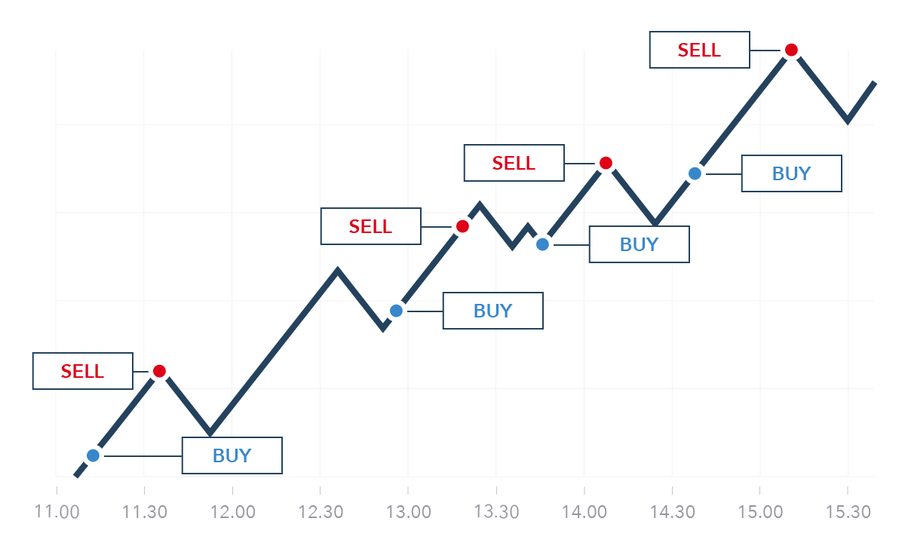

# Trading Strategy Performance Viewer



## Motivation

Target audience: Portfolio managers

Hedge funds each have their own trading styles and approaches, so they usually customize dashboards to effectively monitor their in-house trading strategies. However, portfolio managers and their quantitative teams often find themselves spending significant amount of time and resources on constructing and maintaining dashboards, while their capability and primary responsibility are more on strategy research and development.

To address this, we present an application developed using Streamlit. This app contains the essential metrics for strategy performance monitoring. And it requires approximately 100 lines of code only, and features straightforward logic! This simplicity not only facilitates initial use of the dashboard, but also boosts its scalability, making it a better alternative for strategy monitoring compared to those developed by other tools.

## App Description

Below, we demonstrate the app's usage with toy buy-and-hold strategies based on the [BTC](https://data.binance.vision/?prefix=data/futures/um/daily/klines/BTCUSDT/1m/) and [ETH](https://data.binance.vision/?prefix=data/futures/um/daily/klines/ETHUSDT/1m/) data from Binance.

https://www.youtube.com/watch?v=t90iISeWdw8

## Installation Instructions

1. Clone this repository to your computer.

```bash
git clone https://github.ubc.ca/MDS-2023-24/DSCI_532_individual-assignment_johnshiu.git
```
```bash
cd DSCI_532_individual-assignment_johnshiu
```

2. Install the conda environment.

```bash
conda env create -f environment.yml
```

3. Activate the installed environment.

```bash
conda activate perf_viewer
```

4. Start the dashboard.

```bash
streamlit run src/app.py
```

## License

Trading Strategy Performance Viewer was created by John Shiu. It is licensed under the terms of the MIT license and the Attribution 4.0 International (CC BY 4.0 LEGAL CODE).

## Credits

Klines data in this repository is from the USDT-margined BTCUSDT and ETHUSDT futures, openly available on [Binance Market Data](https://data.binance.vision/?prefix=data/futures/um/daily/klines/).

Banner was created by [Blossom D. in CryptoStars](https://blog.cryptostars.is/whats-your-strategy-for-trading-crypto-and-stocks-99bd121b133a).
